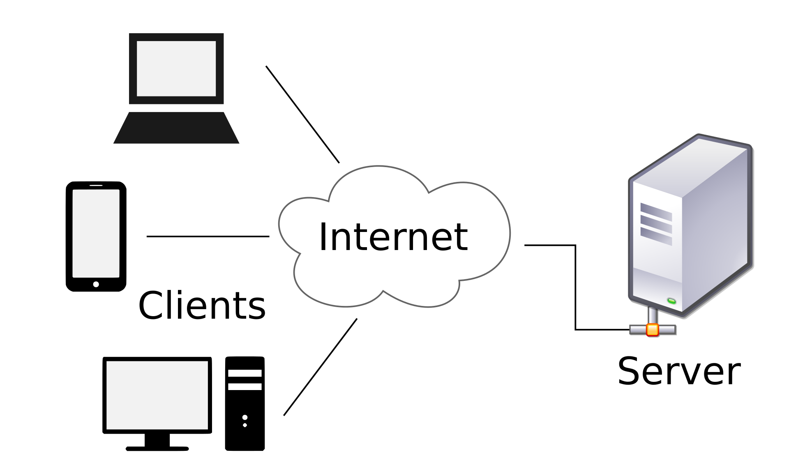

[Apresentação de slides Aula_02](https://docs.google.com/presentation/d/11WVl_ihpBSKrhsnL0eTXVMScqEwNga0g61zPOSEfnRw/edit#slide=id.g477291968f_0_12)

***

# Aula 02
* [Modelo Cliente-Servidor](#modelo-cliente-servidor)
* [Banco de dados](#banco-de-dados)
* [API](#api)
* [Protocolos HTTP](#protocolos-http)


***
## Modelo Cliente-Servidor

Que a internet é uma rede gigante de computadores ligados entre si a gente já sabe, né? ([Caso não, clique aqui!](https://github.com/reprograma/n1-meli-introducao/tree/aula_01#O-QUE-%C3%89-A-INTERNET)) Sabemos também que com o avanço da Arpanet muitas pessoas começaram a se conecetar e foi necessário criar uma maneira melhor de passar o fluxo de informação. O que deu origem ao [TCP/IP](https://github.com/reprograma/n1-meli-introducao/tree/aula_01#modelo-tcpip).

Só que, a internet ela cresceu, muito, muito, muito, muito MESMO! Muitos computadores conectados entre si. E nos anos 70 foi desenvolvido o modelo cliente-servidor, na Xerox PARC, que consiste em dedicar alguns computadores para prover serviços a rede, enquanto os demais acessariam esse serviço.



Esse modelo atualmente é utilizado no Email, na [World Wide Web](https://github.com/reprograma/n1-meli-introducao/tree/aula_01#world-wide-web) e modelos de impressão. 

E como funciona na prática? 

"[...]um navegador web é um programa cliente, em execução no computador do usuário, que acede às informações armazenadas num servidor web na internet. Usuários de serviços bancários, acedendo do seu computador, usam um cliente web para enviar uma solicitação para um servidor web num banco. Esse programa pode, por sua vez, encaminhar o pedido para o seu próprio programa de banco de dados do cliente que envia uma solicitação para um servidor de banco de dados noutro computador do banco para recuperar as informações da conta. O saldo é devolvido ao cliente de banco de dados do banco, que por sua vez, serve de volta ao cliente navegador exibindo os resultados para o usuário." (Fonte: https://pt.wikipedia.org/wiki/Modelo_cliente%E2%80%93servidor)

Dúvidas que podem surgir: 
SERVIDOR WEB: softwere responsável por aceitar requisições HTTP de clientes.

* Características do Cliente:
    * Solicita um pedido/requisição ao servidor;
    * Espera e recebe por respostas;
    * Conecta somente a um servidor por vez;
    * Necessário um software de aplicação especifico que possibilita a comunicação com o servidor;
    * Utiliza recurso de rede.

* Característica do Servidor:
    * Espera uma requisição/pedido do cliente;
    * Atende o pedido e retorna com os dados solicitados;
    * Pode se conectar com outros servidores para atender a requisição/pedido mas não se comunicam;
    * Fornece recurso de rede;
    * Estrutura o sistema.

### Vantagens

* Divisão de responsábilidades. Com computadores independentes a manutenção a ser feita em uma aplicação é muito melhor;
* Todos os dados são armazenados nos servidores que possuem, geralmente, uma segurança muito maior do que a maioria dos clientes;
* Com a centralização dos dados a atualização dees se torna mais fácil;
* Funciona com vários clientes diferentes;
* Grande dispnibilidade de tecnológias avançadas de cliente-servidor e projetadas para garantir a segurança, facilidade de interface do usuário e facilidade de uso.

### Desvantagens

* Sobrecarga do servidor pois são muitos clientes fazendo requisições;
* Se um servidor falha os pedidos dos clientes não poderão ser cumpridos.

***
## Banco de dados

Banco de dados ou base de dados são uma coleção organizada de dados que se relacionam com o objetivo de criar algum sentido/informação durante um estudo ou pesquiza. Basicamente, a grosso modo, é onde ficam os dados armazenados do servidor.

O DB(Data Base) é operado através de um **Sistemas Gerenciadores de Bancos de Dados (SGBD)** que surgiu na década de 70. Nos anos 80 surgiu **SGBD relacional** e ainda muito utilizada no mercadoa atualmente. Outo tipo é o **SGBD Orientado a Objetos**, para quando sua estrutura ou as aplicações que o utilizam mudam constantemente. O SGBD é um sistema muito utilizado em muitas aplicações e são o método preferido de armazenamento/recuperação de dados/informações.

O objetivo de um sistema de banco de dados é promover o isolamento do usuário dos detalhes internos do banco, ou seja, promover a abstração de dados a independência dos dados em relação às aplicações.


* Nível de visão do usuário: as partes do banco de dados que o usuário tem acesso de acordo com a necessidade individual de cada usuário ou grupo de usuários;
* Nível conceitual: define quais os dados que estão armazenados e qual o relacionamento entre eles;
* Nível físico: é o nível mais baixo de abstração, em que define efetivamente de que maneira os dados estão armazenados. (Fonte: https://www.devmedia.com.br/conceitos-fundamentais-de-banco-de-dados/1649)

### Modelo de Base de Dados

* Modelo plano ou tabular
* Modelo em rede
* Modelo hierárquico
* Base de dados relacionais
* Base de dados não relacionais


***
## API

API significa **A**pplication **P**rogramming **I**nterface ou Interface entre Aplicativo e Programação. É um conjunto de instruções e padrões de programação para acesso a um aplicativo de software. Uma empresa de software lança sua API para o público de modo que outros criadores de software possam desenvolver produtos acionados por esse serviço.

Outra definição é: 
"Se uma interface de um sistema é criada para que um usuário final possa usa-la a API é desenvolvida ara que um sistema possa usar as funcionalidades  de um outro sistema programaticamente. Ou seja, a API é interface ideal para que o sistema se comunique com um outro sistema compartilhando suas ações, ferramentas, padrões e protocolos. Gerando aí uma conversa de sistema para sistema" (Fonte: [API // Dicionário do Programador
](https://www.youtube.com/watch?v=vGuqKIRWosk))

### Como funciona? 

A forma mais comum de realizar uma hoje API é usando REST (Representational State Transfer), que nada mais é que um estilo de arquitetura. A API utiliza o modelo cliente-servidor ([sim, o mesmo que vimos anteriomente](#modelo-cliente-servidor)) e quase sempre utiliza o protocolo HTTP.

"A REST foi concebida para tratar objetos originados do servidor como recursos que podem ser criados, atualizados ou destruídos. Exemplo: uma postagem de blog em um banco de dados. A postagem pode ser criada através da utilização de um requerimento para criação de postagem, atualizado com um requerimento de atualização ou deletada com um requerimento de eliminação, e por aí vai.

O que torna a REST incrível é o fato dela conseguir realizar todas as suas operações só por meio de HTTP, mais algum tipo de padrão ou formato aberto como JSON ou XML. Ou seja, REST pode ser virtualmente utilizada por qualquer linguagem de programação. Isso porque a maioria das linguagens boas podem fazer requerimentos HTTP de alguma forma, seja PHP, Javascript, Python, etc." (Fonte: https://usemobile.com.br/o-que-e-uma-api/)

Saiba mais em: [API para iniciantes](https://apiparainiciantes.netlify.com/), [API // Dicionário do Programador
](https://www.youtube.com/watch?v=vGuqKIRWosk), [O que é uma API?](https://usemobile.com.br/o-que-e-uma-api/)

Exemplo de API: https://developers.mercadolivre.com.br/pt_br/guia-para-produtos/envio-de-produto

## JSON

JSON significa **J**avaScript **O**bject **N**otation. São dados salvos em um arquivo .json e consistem em uma série de pares chave / valor.

```js

{"chave" : "valor"}

```


***
## Protocolos HTTP 

"Hypertext Transfer Protocol (HTTP) é um protocolo de camada de aplicação para transmissão de documentos hipermídia, como o HTML. Foi desenvolvido para comunicação entre navegadores web e servidores web, porém pode ser utilizado para outros propósitos também. Segue um modelo cliente-servidor clássico, onde um cliente abre uma conexão, executa uma requisição e espera até receber uma resposta. É também um protocolo sem estado ou stateless protocol, que significa que o servidor não mantem nenhum dado entre duas requisições (state). Apesar de ser frequentemente baseado em uma camada TCP/IP, pode ser utilizado em qualquer camada de transporte confiável, ou seja, um protocolo que não perde mensagens silenciosamente como o UDP." (Fonte: https://developer.mozilla.org/pt-BR/docs/Web/HTTP)

Tipos de protocolo http:

* GET -	Pedido do recurso situado no URL especificado
* HEAD -	Pedido do cabeçalho do recurso situado no URL especificado
* POST -	Envio de dados ao programa situado no URL especificado
*  PUT -	Envio de dados ao URL especificado
* DELETE -	Remoção do recurso situado no URL especificado
