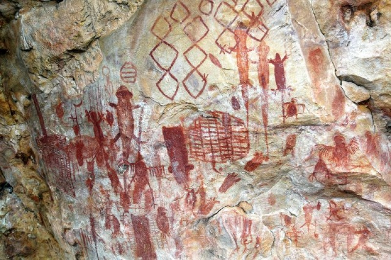
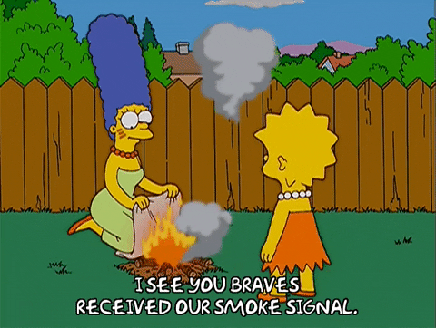
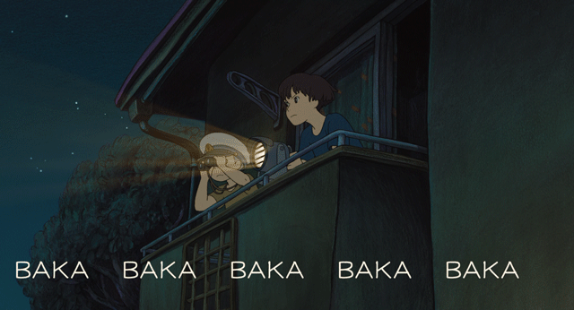
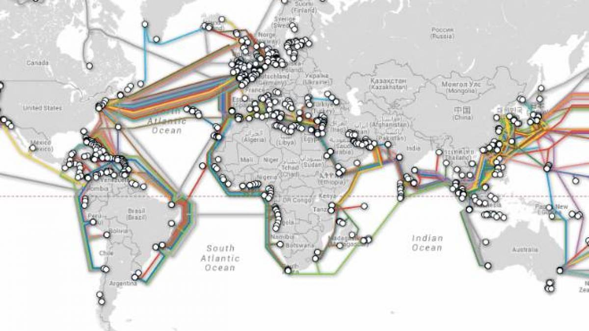
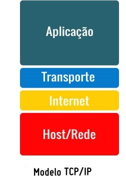

[Apresentação  de slides - AULA_01](https://docs.google.com/presentation/d/11m9n4vaJaN9qB5pD3tYyYDwT2oxcJHOYQTOVkUMJP70/edit?usp=sharing)

***

## AULA 01
* [Um pouco de história](#um-pouco-de-história)
* [O que é a internet?](#O-QUE-É-A-INTERNET)
    * [Modelo TCP/IP](#modelo-tcpip)
    * [World Wide Web](#world-wide-web)
* [Iot](#Internet-das-coisas---IoT)

***
## UM POUCO DE HISTÓRIA

O ser humano sempre amou se comunicar. E temos infinitas provas disso. 

Tenho certeza que inventamos mais não é mesmo? 

Mas o que aconteceu no período entre a pintura rupestre, sinal de fumaça e nosso smartphone que possibilitou a maior era da comunicação? 

**INTERNET**

A internet foi criada em maio de 1969, na guerra fria, por  Joseph Carl Robnett Licklider  a pedido da Agência de Pesquisa de Projetos Avançados (Arpa) do Departamento de Defesa Norte-americano. O objetivo de criação foi:  COMUNICAÇÃO. Mas precisava ser diferente da comunicação que existia naquela época pois a mensagem não podia ser interceptada.  A solução adotada foi separar a mensagem em pacotes e  transmiti-los através de um sistema de rede de computadores.  O nome dado a esse sistema foi [Arpanet](https://pt.wikipedia.org/wiki/ARPANET). A Arpanet foi a primeira rede a utilizar a tecnologia de comutação de pacotes para comunicação entre computadores.  

Estabelecidas as comunicações entre os nós, a atenção dos usuários da Arpanet se voltou para o desenvolvimento das aplicações entre servidores. Em 1972 surgiu o correio eletrônico a primeira aplicação da Arpanet que revolucionou mais uma vez a forma de comunicação pois permitiu  a troca, armazenamento e pesquisa de mensagens.

Em 1973  pesquisadores da Universidade de Stanford apresentaram a primeira versão do Protocolo de Controle de Transporte/Protocolo Inter-redes (**TCP/IP**), que iria revolucionar as comunicações no mundo. Com essa criação a Arpanet foi desmilitarizada( sim! ela fazia parte das froças armadas amaericanas) e seguimentada  em Milnet, exclusiva das forças armadas e Arpanet para fins acadêmicos e de pesquisa e que, posteriormente, recebeu o nome de internet.

Hoje, a internet é coordenada pelo Conselho
de Atividades da Internet, o [IAB](http://www.iab.org/iab), juntamente com a Força Tarefa de Pesquisa da Internet, a [IRTF](http://irtf.org/) e tem mais dedois bilhões de usuários conectados.

***
## O QUE É A INTERNET? 

A internet é o conjunto de redes de computadores que, espalhados por todas as regiões do planeta, conseguem trocar dados e mensagens utilizando um protocolo comum.

### [Cabos Submarinos](https://www.submarinecablemap.com/)

## MODELO TCP/IP

O modelo TCP/IP é um conjunto de protocolos que que permite a interconexão de redes de tipos diferentes
em pequena, média e grande escala.

* Camada de rede: responsável pelo endereçamento lógico, necessário para identificação única das máquinas na rede.
    * Protocolos da camada:
        * Protocolo IP: Atribui um endereço lógico e determina o caminho que o pacote  deve percorrer a partir do nó de origem até o destino.

        * Protocolo ARP:  resolve o endereço físico do nó de destino.

        * Protocolo ICMP:  Ele informa através de mensagens ao remetente os erros enfrentados pelo pacote durante a rota. Permite também testar a conectividade entre dois nós da rede.

* Camada de transporte: responsável por fornecer um transporte confiável para as mensagens que chegam da camada de aplicação. Usa o endereço de porta.
    * Protocolos da camada: 
        *  Protocolo TCP: Ele garante a entrega dos dados mesmo que os pacotes cheguem fora de ordem usando um identificador que deve ser conferido no destino.

        * Protocolo UDP: Não garante a entrega do pacote como o TCP, o que o torna bastante eficiente em redes confiáveis, com baixa perda de pacotes. É usado principalmente para transporte de voz e vídeo na rede.

* Camada de aplicação: Aqui, estão as aplicações nativas e os serviços de rede do TCP/IP.
    * Serviço de WEB – Transferência de arquivos de texto e gráficos através do Protocolo de Transferência de Hipertexto – HTTP.
    * Serviço de correio – Transferência de mensagens de correio eletrônico entre servidores usando o Protocolo de Transferência de Correio Simples – SMTP. 
    * Serviço de arquivo – Transferência de arquivos entre máquinas usando o Protocolo de Transferência de Arquivos – FTP. 
    * Configuração automática de endereço IP – Fornece endereço lógico automaticamente na rede para máquinas. Evita erros de configuração manual de endereço. Usa o Protocolo de Configuração Dinâmica de Máquinas – DHCP.
    * Serviço de nomes de domínio – Traduz nomes de domínio em endereços lógicos. Muito útil para navegação na WEB. Quando você digita no seu navegador www.ifro.edu.br, a sua máquina faz uma consulta ao servidor de nomes de domínio (DNS) que retorna o endereço IP do servidor de WEB do Ifro (201.45.226.220). 

A camada que iremos mais utilizar é a da **APLICAÇÃO**. Para compreende-la melhor é preciso explicar a WEB. 

## World Wide Web 

A rede mundial de computadores, em inglês World Wide Web (www, web), é a reunião de várias mídias interligadas por sistemas eletrônicos de comunicação e executadas na Internet através do navegador. 

Ela funciona da seguinte maneira:
Ao digitar uma URL no navegador, ou clicar em uma,a  aparte referente ao servidor web (www.**google.com**) é separada e transformada em endereço de IP, por um banco de dados da Internet chamado domain name system (DNS). Feito isso o navegador estabelece uma conexão TCP/IP com o servidor web. 
Estabelecida essa conexão o navegador passa a enviar requisições HTTP ao servidor para obter alguns serviços ou recursos do servidor. 
Essas "respostas" dos servidor serao renderizadas na tela através do HTML.

Três padrôes básicos necessários para funcionalidade da web:
* URL
* HTTP
* HTML

A web possui três fases: 

* web 1.0: conteúdo estático. Todo o conteúdo da página é somente para leitura. Somente o programador ou webmaster consegue fazer alterações ou atualizar as páginas.

* web 2.0: Utilizada atualmente. É uma web mais dinâmica. O usuário consegue interagir e participar da aplicação. Diminui a taxa de download e aumente a taxa de upload.

* web 3.0: tem como o objetivo mudar a s formas de pesquisa e facilitar a vida do usuário.

Existe um site que guarda todos os sites do mundo, desde da sua criação até os dias atuais. o nome dele é [Internet Archive](https://archive.org/).

A principal organização de padronização da World Wide Web é a [W3C](https://www.w3.org/)

## Internet das coisas - IoT

Internet od things (IoT) ou "Internet das coisas" é uma revolução tecnológica que conecta dispositivos, itens, coisas, usadas no dia-a-dia a rede de computadores. O objetivo é que cada vez mais o meio físico e o digital sejam uma coisa só. 

E o que seria essa internet das coisa? Pois muito bem, sabe aquele carro "inteligente" que tem um computador de bordo que conecta na internet no seu celular? Ou aquela geladeira que sabe o que tem dentro dela e te passa mensagem do que está faltando? Ou melhor aquele relógio que faz infinitas funções. Pois é... internet das coisas :)

nesse vídeo tem uma explicação sobre 
[IoT](https://www.youtube.com/watch?time_continue=4&v=jlkvzcG1UMk)